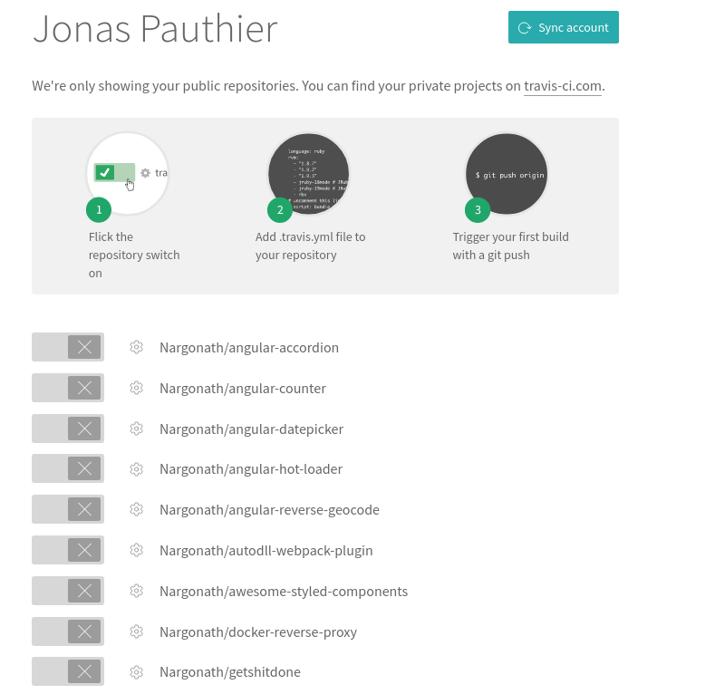
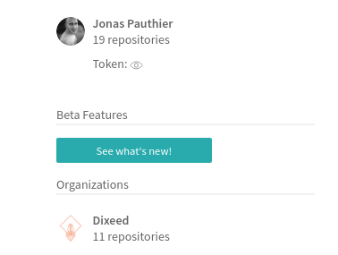
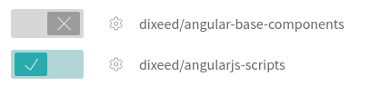

<div align="center">
  <h1>How to create a public NPM package</h1>
</div>

## Inspiration

This documentation is based on this [Egghead.io excellent video](https://egghead.io/courses/how-to-write-an-open-source-javascript-library) from [Kent C. Dodds](https://github.com/kentcdodds). I recommend watching it. Huge thanks for his amazing work. :clap: :tada:

## Requirements

This documentation assumes that your repository is open source and hosted on **Github** hence you should have created a public Github repository. You need then to **clone** your repository on your computer to start working on it.

## Steps

### Step 1: Setup NPM package boilerplate

Move into your project folder.

You need to create the base files for your package. `npm init` will walk you through a set of questions and will generate a `package.json` file for you.

Let's consider a base `package.json` as the one below:

```json
{
  "name": "docs",
  "version": "1.0.0",
  "description": "My description",
  "main": "index.js",
  "scripts": {
    "test": "echo \"Error: no test specified\" && exit 1"
  },
  "repository": {
    "type": "git",
    "url": "https://github.com/dixeed/docs.git"
  },
  "author": "Nargonath <jonas.pauthier@gmail.com>",
  "license": "MIT",
  "bugs": {
    "url": "https://github.com/dixeed/docs/issues"
  },
  "homepage": "https://github.com/dixeed/docs#readme"
}
```

### Step 2: Setup Travis CI service

We're going to use Travis as our CI (continuous integration) service.

To get started you need to create an account (or connect if you already have one). Head [here](https://travis-ci.org/) to do so. You just need to use Github authentication to connect.

Once connected you should access your profile:
<p align="center">
  
</p>

Here you have the list of your public Github repositories:
<p align="center">
  
</p>

If you don't find your project in the list, you can use the **Sync account** that you can see on the above picture. It will update your Github information.

If the repository you are working on is part of an [Organization Github account](https://help.github.com/articles/collaborating-with-groups-in-organizations/) you can find the list of your organizations on the left of your repositories list:
<p align="center">
  
</p>

Once you have found the repository you are working on, you just need to activate it using the switch on the left of its name:
<p align="center">
  
</p>

That's it! Travis is enabled for your project. It does not work as is but we'll get it working in the next section.


### Step 3: Setup NPM

In order to publish NPM packages you also need an NPM account. Follow [this link](https://www.npmjs.com/signup) to create an account or log in with an existing one.

If you want to publish your package as part of an NPM organization, you need to be a member of it thus you need to ask to an owner of the organization to invite you in.


### Step 4: Setup automatic deployment tooling

Now that we have Travis configured we want to automate our deployment workflow. It will handle several things for us:
* Our [Semantic versioning](http://semver.org/).
* Publish to NPM the new versions of our package.
* Create *Git tags* in our Github repository.

To make all of this possible we are going to use a library: [Semantic Release](https://github.com/semantic-release/semantic-release). It will read our commit messages and based on their content it will determine what *semver* bump it needs to do (Major, Minor or Bugfix). To make its job easier (and possible) we need to enforce a particular commit message format. [This is](https://github.com/angular/angular.js/blob/master/CONTRIBUTING.md#-git-commit-guidelines) the format used by Angular team on their own repository.

Ok, now that's the introduction is done let's do it.

#### Install required packages

We'll need to install several development dependencies but we also need to install a global package to setup the last bit of the Travis configuration.

_For npm users:_

`npm i -D --save-exact @commitlint/cli @commitlint/config-angular commitizen cz-conventional-changelog husky lint-staged semantic-release prettier`

`npm i -g semantic-release-cli`

_For Yarn users:_

`yarn add -D --exact @commitlint/cli @commitlint/config-angular commitizen cz-conventional-changelog husky lint-staged semantic-release prettier`

`yarn global add semantic-release-cli`

##### Explanations

Here is the purpose of each dependency:
* [@commitlint/cli](https://github.com/marionebl/commitlint): will lint our commit messages to make sure we are using the right format
* [@commitlint/config-angular](https://github.com/marionebl/commitlint#shared-configuration): the configuration we are going to use. There are multiple different config but that's the one we want.
* [commitizen](https://github.com/commitizen/cz-cli): CLI to help us write commit messages with the right format. It will ask us different questions to fill up the commit messages.
* [cz-conventional-changelog](https://github.com/commitizen/cz-conventional-changelog): will generate detailed changelog based on our commit messages.
* [husky](https://github.com/typicode/husky): adds git hooks for pre/post commit, pre/post push and so on.
* [lint-staged](https://github.com/okonet/lint-staged): allow us to run linters against staged git files and prevent commit if the linters spot errors/warnings.
* [prettier](https://github.com/prettier/prettier): formats our code

#### Add configuration

Now that all the dependencies are installed we need to configure them. Add these parts to your package.json (they are supposed to be top keys):
```json
{
  "scripts": {
    "cm": "git-cz",
    "commitmsg": "commitlint -e",
    "precommit": "lint-staged"
  },
  "config": {
    "commitizen": {
      "path": "cz-conventional-changelog"
    }
  },
  "lint-staged": {
    "{bin,config,scripts,test}/**/*.{js,css,json}": [
      "prettier --single-quote --write --print-width 100 --trailing-comma es5",
      "git add"
    ]
  }
}
```

To use Commitizen we shouldn't use `git commit` command anymore but `git cz` which is added by Commitizen itself. We added a script for that `cm` hence you just need to run `npm/yarn run cm`. **Remember to run `git add` before**.

We configured Prettier to run against our *bin*, *config*, *scripts* and *test* folders. It will formats all js, css and json files in it. You can change the paths to better suit your project structure. The path follows [glob pattern](https://github.com/isaacs/node-glob) syntax. Thanks to lint-staged and husky Prettier will be run on our staged files before committing to make sure all committed code is formatted the same way in the whole project.

You need to add `commitlint.config.js` at your project root as well. It should contain:
```javascript
'use strict';

module.exports = {
  extends: ['@commitlint/config-angular'],
};
```

#### Finish Travis configuration

Before using the global CLI you installed previously, we need to make sure our `repository` field in the package.json is in the right format. It needs to be written that way:

```json
{
  "repository": {
      "type": "git",
      "url": "https://github.com/dixeed/angularjs-scripts.git"
  }
}
```

If it is not, the CLI will crash so make sure it is. Of course, make sure to **write your own Github repository URL**.

Then you just need to run, `semantic-release-cli setup` in your project root. It will ask you a bunch of information:
* Github credentials to generate a GITHUB_TOKEN used for Travis
* NPM credentials to publish the NPM package for you
* Which CI you want: Select *Travis*
* Do you want a travis.yml file be generated for you? Say *Yes*.

And you'll be good to go. It will have added the `travis.yml` file at your project root and modified your `package.json`. Here is the information that are added/updated by semantic-release-cli:
```json
{
  "version": "0.0.0-development",
  "scripts": {
    "semantic-release": "semantic-release pre && npm publish && semantic-release post"
  }
}
```

You don't have to manage yourself your package version anymore, semantic-release will handle it for you after a successful Travis run.

The script `semantic-release` will be runned during your Travis run and is responsible for generating your NPM package, publishing to NPM and creating the according *git tag* in your Github repo along with the changelog.

Now let's take a look at the `travis.yml` file:
```yml
language: node_js
cache:
  directories:
    - node_modules
notifications:
  email: false
node_js:
  - '8'
  - '7'
before_install:
  - npm install -g npm@latest
after_success:
  - npm run semantic-release
branches:
  except:
    - /^v\d+\.\d+\.\d+$/
```

Your `travis.yml` might not be identical as this one so I'll just pinpoint the import part:
* Make sure to always have a **Node v8+** build in your configuration. Semantic-release does not work in an environment < Node v8.0.0. In Travis the run with the highest Node version is the build leader so it will be responsible of running the `npm run semantic-release` command.
* Your package will be runned against every node version specified in the `node_js` property. They all need to pass for your build to succeed.
* If you are using the latest version of NPM, make sure to update it before Travis installs your project dependencies by adding:
```yml
before_install:
  - npm install -g npm@latest
```
* The part with `npm prune` might not be useful so you can delete it. It can even be a problem and remove semantic-release hence preventing you from publishing. (That's the conclusion I came to but if I'm wrong feel free to make a PR and correct that :+1: ).
* Travis runs by default your `npm/yarn test` script defined in your `package.json`.


### Step 5: Add NPM metadata

To provide NPM with as much information about your package we have to update your `package.json`.

First if you want to publish your package as a **scoped package** meaning that it is part of an organization then you need to update your package name as is: `"name": "@scope/packageName"` i.e for an organization named `dixeed` and a package `utils` the updated name would be: `@dixeed/utils`.

Make sure you have a `main` field as well. See [this](https://docs.npmjs.com/files/package.json#main) for more information.

Then you can add `keywords` to your package to help users searching for it in the NPM registry. See [this](https://docs.npmjs.com/files/package.json#keywords) for more information.

You need also to specify which files needs to be part of your package for your users to properly use it. See [this](https://docs.npmjs.com/files/package.json#files) for more information. A good rule of thumb is that **if your package does not depend on a file or folder to run don't add it** i.e tests folder. If your package is compiled by some library (webpack, rollup, babel ...) you might want to include only the files resulting from their build.

If your package depends on particular version of node or npm you can specify it in the `engines` field. See [here](https://docs.npmjs.com/files/package.json#engines) for more information.

Fields to consider depending on your needs: [peerDependencies](https://docs.npmjs.com/files/package.json#peerdependencies), [bin](https://docs.npmjs.com/files/package.json#bin).

Full documentation is [here](https://docs.npmjs.com/files/package.json).


### Step 6: Commit your awesome work!

Everyting has been setup in the previous steps for your environment to deploy your package. You just need to actually commit your work for semantic-release to have something to work with.

When using `npm/yarn run cm` you will be prompted about which kind of commit you are trying to do. You should know that only two types actually impact your package semver:
* `feat`
  * Alone a `feat` commit with bump the minor version number.
  * If the commit message comes with a `BREAKING CHANGE: ` in its footer then it will bump the major version number.
* `fix`
  * It will bump your bugfix version number.

Semantic-release will aggregate your different commits to determine your next semver version i.e if you have 2 bugfixes and 5 feat commit (without any breaking change mentions) it will gather all of them under one single minor version bump. So if your previous version was: *v1.3.4* the next one will be *v1.4.0*.

You need to be using semantic-release from the ground up. Just make sure to push your commits on master once you are satisfied for a `v1.0.0` release. Semantic-release will always push your first version as `v1.0.0`. If you want to commit your Work In Progress just create a `dev` branch and work on it until you're satisfied with your current work state for the release then merge it on master and push.

### Optional

If you don't want to publish on NPM but rather just use semantic-release for your project versioning, you can take a look at [last-release-git](https://github.com/finom/last-release-git).
